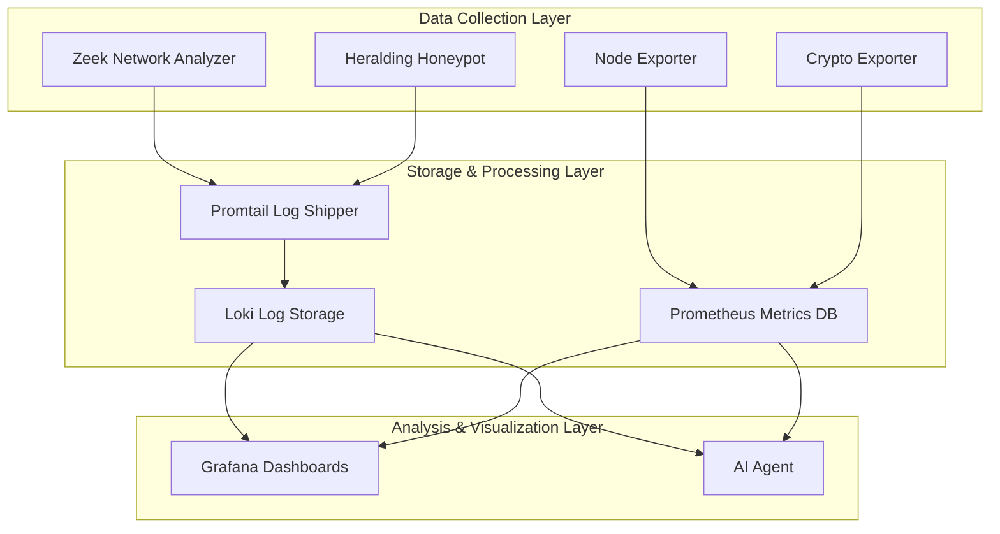
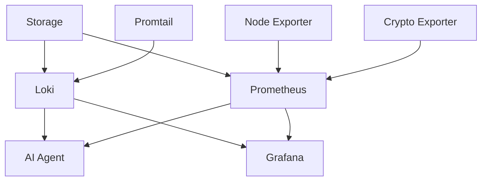

# System Components

The Network Security Monitor consists of nine integrated services that work together to provide comprehensive security monitoring and analysis.

## Architecture Overview



## Core Components

### Zeek Network Analyzer

**Purpose**: Deep packet inspection and network security monitoring

**Features**:
- Real-time traffic analysis on dedicated network interface
- Protocol-aware log generation (HTTP, DNS, SSL/TLS, SSH, etc.)
- Connection tracking and session analysis
- Anomaly detection and security event logging
- File extraction and malware detection

**Logs Generated**:
- `conn.log` - Connection summaries
- `dns.log` - DNS queries and responses
- `http.log` - HTTP transactions
- `ssl.log` - SSL/TLS certificate information
- `ssh.log` - SSH connection details
- `files.log` - File transfers and downloads

**Configuration**:
- Network interface monitoring
- Custom security policies
- Log retention settings

---

### Heralding Honeypot

**Purpose**: Multi-protocol honeypot for deception-based threat detection

**Supported Protocols**:
- SSH (port 22)
- Telnet (port 23)
- FTP (port 21)
- HTTP (port 80)
- HTTPS (port 443)
- SMB (port 445)

**Capabilities**:
- Simulates vulnerable services
- Captures attack attempts and credentials
- Logs brute-force attacks
- Records command execution attempts
- Identifies attack sources and patterns

**Log Format**:
```json
{
  "timestamp": "2025-11-06T10:30:00Z",
  "session_id": "abc123",
  "source_ip": "192.168.1.100",
  "protocol": "ssh",
  "credentials": "admin:password123",
  "commands": ["ls", "cat /etc/passwd"]
}
```

---

### AI Agent

**Purpose**: OpenAI-powered threat analysis and automated reporting

**Architecture**:
- **MCP Server**: Structured data access via Model Context Protocol
- **FastAPI**: RESTful API for integration
- **Ollama Integration**: Local LLM inference for privacy
- **Multi-source Analysis**: Combines logs from all components

**Key Features**:
- Automated threat detection and classification
- Natural language security queries
- Scheduled security report generation
- Real-time alert correlation
- Attack pattern recognition

**API Endpoints**:
- `/reports/generate` - Create security reports
- `/query` - Natural language queries
- `/analyze/honeypot` - Honeypot threat analysis
- `/analyze/network` - Network security assessment

---

### Grafana Dashboards

**Purpose**: Visualization platform with pre-built security dashboards

**Pre-configured Dashboards**:

1. **Zeek Security Overview**
   - Network traffic patterns
   - Security alerts and anomalies
   - Top talkers and protocols

2. **Zeek Connection Analysis**
   - Connection tracking and flows
   - Bandwidth utilization
   - Service discovery

3. **Zeek DNS Security Analysis**
   - DNS query monitoring
   - Malicious domain detection
   - DNS tunneling detection

4. **Zeek SSL/TLS Analysis**
   - Certificate monitoring
   - Encryption protocol analysis
   - Invalid certificate alerts

5. **Honeypot Attack Overview**
   - Attack attempt visualization
   - Geographic attack sources
   - Credential analysis

6. **AI Security Reports**
   - Automated threat summaries
   - Risk assessment metrics
   - Report generation status

7. **SSD I/O Monitoring**
   - Storage performance metrics
   - I/O latency and throughput

8. **SSD Storage Monitoring**
   - Disk usage and capacity
   - Storage health metrics

**Access**: `http://<NODE_IP>:3000` (admin/admin)

---

## Storage & Processing Components

### Loki Log Storage

**Purpose**: Centralized log aggregation and storage

**Features**:
- Highly efficient log storage
- Label-based log organization
- Fast log querying and filtering
- Integration with Grafana
- Prometheus-style query language (LogQL)

**Storage Structure**:
```
/mnt/ssd-logs/loki-data/
├── chunks/     # Log data chunks
├── index/      # Search indexes
└── wal/        # Write-ahead log
```

**Default Retention**: 30 days (configurable)

---

### Prometheus Metrics Database

**Purpose**: Time-series metrics collection and storage

**Metrics Sources**:
- Node Exporter (system metrics)
- Crypto Exporter (cryptocurrency prices)
- Custom application metrics
- Kubernetes cluster metrics

**Key Metrics**:
- CPU, memory, disk usage
- Network interface statistics
- Container resource consumption
- Custom security metrics

**Query Language**: PromQL for advanced metric analysis

---

### Promtail Log Shipper

**Purpose**: Log collection and forwarding to Loki

**Responsibilities**:
- Tail log files from Zeek and honeypots
- Parse and label log entries
- Buffer and forward logs to Loki
- Handle log rotation and file discovery

**Configuration**:
- Multiple log source definitions
- Custom parsing rules
- Label extraction patterns
- Retry and error handling

---

## Supporting Components

### Node Exporter

**Purpose**: System and hardware metrics collection

**Metrics Collected**:
- CPU usage and load average
- Memory and swap utilization
- Disk I/O and space usage
- Network interface statistics
- System uptime and processes

### Crypto Exporter (Optional)

**Purpose**: Cryptocurrency price tracking for context

**Supported Currencies**:
- Bitcoin (BTC)
- Ethereum (ETH)
- Tron (TRX)

**Use Case**: Correlate crypto price movements with ransomware activity

---

## Component Communication

### Data Flow

1. **Collection**: Zeek and Honeypot generate logs
2. **Shipping**: Promtail collects and forwards logs to Loki
3. **Storage**: Loki stores logs, Prometheus stores metrics
4. **Analysis**: AI Agent queries Loki for threat analysis
5. **Visualization**: Grafana displays dashboards from both sources

### Network Ports

| Component | Port | Purpose |
|-----------|------|---------|
| Grafana | 3000 | Web interface |
| Prometheus | 9090 | Metrics API |
| Loki | 3100 | Log ingestion API |
| AI Agent | 8080 | REST API |
| Node Exporter | 9100 | Metrics endpoint |
| Crypto Exporter | 9101 | Metrics endpoint |

### Service Dependencies



## Resource Requirements

### Minimum System Requirements

| Component | CPU | Memory | Storage |
|-----------|-----|--------|---------|
| Zeek | 1 core | 1GB | 30GB |
| Heralding | 0.5 core | 512MB | 10GB |
| Loki | 1 core | 2GB | 20GB |
| Prometheus | 1 core | 2GB | 20GB |
| Grafana | 0.5 core | 512MB | 5GB |
| AI Agent | 1 core | 1GB | 2GB |

**Total Recommended**: 4+ cores, 8GB+ RAM, 100GB+ SSD storage

### Scaling Considerations

- **High Traffic Networks**: Increase Zeek and Loki resources
- **Extended Retention**: Scale storage for Loki and Prometheus
- **Multiple Honeypots**: Deploy additional Heralding instances
- **Load Balancing**: Use multiple AI Agent instances for high query loads

## Next Steps

- [Installation Guide](installation.html) - Deploy all components
- [Configuration](configuration.html) - Customize your setup
- [Dashboards](dashboards.html) - Explore the visualization options
- [API Reference](api-reference.html) - Integrate with the AI Agent