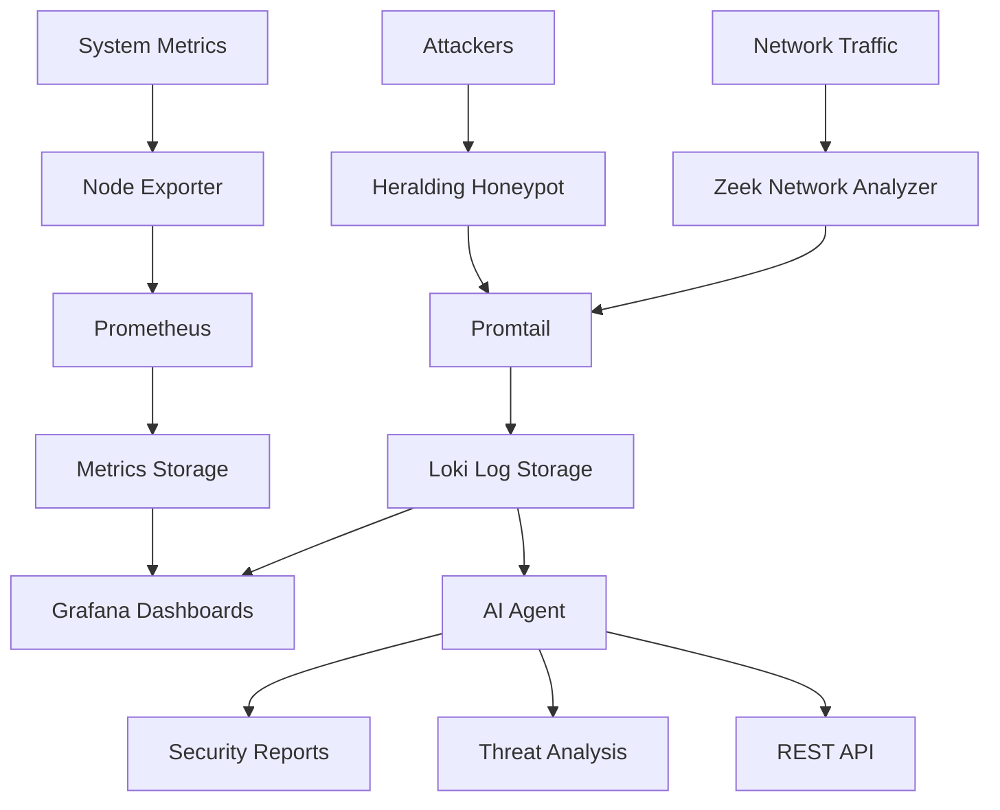

# Network Security Monitor

A comprehensive security monitoring platform designed to detect, analyze, and respond to network threats through automated intelligence gathering and real-time analysis.

{: .fs-6 .fw-300 }

[Get started now](getting-started.html){: .btn .btn-primary .fs-5 .mb-4 .mb-md-0 .mr-2 }
[View on GitHub](https://github.com/garrigueta/network-security-monitor){: .btn .fs-5 .mb-4 .mb-md-0 }

---

## Overview

This project provides an end-to-end network security monitoring solution that combines passive traffic analysis, active threat detection through honeypots, and AI-powered security intelligence. The system continuously monitors your network perimeter, captures attack attempts, and generates actionable security reports.

### Key Capabilities

- **Deep packet inspection** of all network traffic using Zeek
- **Deception-based threat detection** with multi-protocol honeypots
- **AI-driven threat analysis** and automated report generation
- **Centralized log aggregation** and metrics collection
- **Pre-built security dashboards** for instant visibility
- **RESTful API** for integration with other security tools

### Use Cases

- Network perimeter monitoring and threat detection
- Attack pattern analysis and threat intelligence gathering
- Security operations center (SOC) data aggregation
- Incident response and forensic analysis
- Compliance monitoring and audit trail generation

## How It Works

The platform operates in three integrated layers:

### 1. Data Collection Layer
- **Zeek** monitors network traffic on a dedicated interface, generating logs for connections, DNS queries, HTTP requests, SSL/TLS handshakes, and more
- **Heralding honeypot** simulates SSH, Telnet, FTP, and HTTP services to attract and log unauthorized access attempts
- **System metrics** from Node Exporter track infrastructure health

### 2. Storage and Processing Layer
- **Promtail agents** tail logs from Zeek and honeypots, forwarding to Loki
- **Prometheus** scrapes metrics from all exporters for time-series analysis
- All logs and metrics persist to SSD storage for fast querying

### 3. Analysis and Visualization Layer
- **Grafana dashboards** provide real-time views of security events, network patterns, and system health
- **AI Agent** (Ollama LLM-powered) analyzes aggregated logs to identify threats, generate security reports, and provide natural language insights
- Automated attack pattern detection across all data sources
- Scheduled reports with on-demand API access available

## Architecture Overview



## Quick Start

Deploy the entire stack with a single command:

```bash
make all
```

This will build all container images and deploy the Helm chart to your Kubernetes cluster.

## What's Next?

- [Installation Guide](installation.html) - Complete setup instructions
- [Configuration](configuration.html) - Customize your deployment
- [Components](components.html) - Learn about each system component
- [Dashboards](dashboards.html) - Explore the security visualizations
- [AI Agent](ai-agent.html) - AI-powered threat analysis and automation
- [API Reference](api-reference.html) - Integrate with your tools