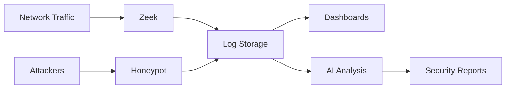

# Network Security Monitor

A comprehensive security monitoring platform designed to detect, analyze, and respond to network threats through automated intelligence gathering and real-time analysis.

## 🚀 Quick Start

**[Get Started](guides/getting-started/getting-started.html)** | **[View on GitHub](https://github.com/garrigueta/network-security-monitor)**

---

## Overview

This project provides an end-to-end network security monitoring solution that combines passive traffic analysis, active threat detection through honeypots, and AI-powered security intelligence. The system continuously monitors your network perimeter, captures attack attempts, and generates actionable security reports.

### Key Capabilities

- **Deep packet inspection** of all network traffic using Zeek
- **Deception-based threat detection** with multi-protocol honeypots
- **AI-driven threat analysis** and automated report generation
- **Centralized log aggregation** and metrics collection
- **Pre-built security dashboards** for instant visibility
- **RESTful API** for integration with other security tools

### Use Cases

- Network perimeter monitoring and threat detection
- Attack pattern analysis and threat intelligence gathering
- Security operations center (SOC) data aggregation
- Incident response and forensic analysis
- Compliance monitoring and audit trail generation

## How It Works

The platform operates in three integrated layers:

### 1. Data Collection Layer
- **Zeek** monitors network traffic on a dedicated interface, generating logs for connections, DNS queries, HTTP requests, SSL/TLS handshakes, and more
- **Heralding honeypot** simulates SSH, Telnet, FTP, and HTTP services to attract and log unauthorized access attempts
- **System metrics** from Node Exporter track infrastructure health

### 2. Storage and Processing Layer
- **Promtail agents** tail logs from Zeek and honeypots, forwarding to Loki
- **Prometheus** scrapes metrics from all exporters for time-series analysis
- All logs and metrics persist to SSD storage for fast querying

### 3. Analysis and Visualization Layer
- **Grafana dashboards** provide real-time views of security events, network patterns, and system health
- **AI Agent** (Ollama LLM-powered) analyzes aggregated logs to identify threats, generate security reports, and provide natural language insights
- Automated attack pattern detection across all data sources
- Scheduled reports with on-demand API access available

## Architecture Overview



## Quick Start

Deploy the entire stack with a single command:

```bash
make all
```

This will build all container images and deploy the Helm chart to your Kubernetes cluster.

## 📚 Documentation

### 🚀 Getting Started
- [**Quick Start Guide**](guides/getting-started/getting-started.html) - Start monitoring in minutes
- [**Features Overview**](guides/getting-started/features.html) - 20+ platform capabilities
- [**Architecture**](guides/getting-started/architecture.html) - System design and data flow
- [**Components**](guides/getting-started/components.html) - Component overview

### 🚢 Deployment
- [**Installation Guide**](guides/deployment/installation.html) - Complete setup instructions
- [**Configuration**](guides/deployment/configuration.html) - Customize your deployment

### 📊 Monitoring & Dashboards
- [**Dashboards**](guides/monitoring/dashboards.html) - 3 pre-built security dashboards
- [**Dashboard Roadmap**](guides/monitoring/dashboard-roadmap.html) - Future enhancements

### 🤖 AI Agent
- [**AI Agent Overview**](guides/ai-agent/ai-agent.html) - AI-powered threat analysis
- [**API Documentation**](guides/ai-agent/ai-agent-api.html) - AI agent API reference
- [**Attack Patterns**](guides/ai-agent/ai-agent-attack-patterns.html) - Detection patterns
- [**Automation**](guides/ai-agent/ai-agent-automation.html) - Automated analysis
- [**Configuration**](guides/ai-agent/ai-agent-configuration.html) - AI agent settings
- [**Logging**](guides/ai-agent/ai-agent-logging.html) - Log management

### 🔌 API Reference
- [**API Endpoints**](guides/api/endpoints.html) - Complete endpoint reference (25+ endpoints)
- [**API Integration**](guides/api/api-reference.html) - Integration examples and SDKs

### 🛠️ Additional Resources
- [**📖 Quick Reference**](quick-reference.html) - Fast lookup guide for common tasks
- [**Troubleshooting**](troubleshooting.html) - Common issues and solutions
- [**Contributing**](contributing.html) - How to contribute to the project

### Operations
- [Troubleshooting](troubleshooting.html) - Common issues and solutions
- [Contributing](contributing.html) - How to contribute